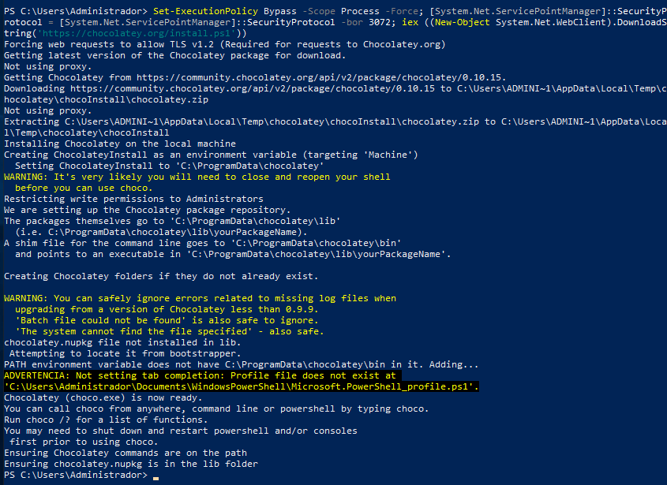
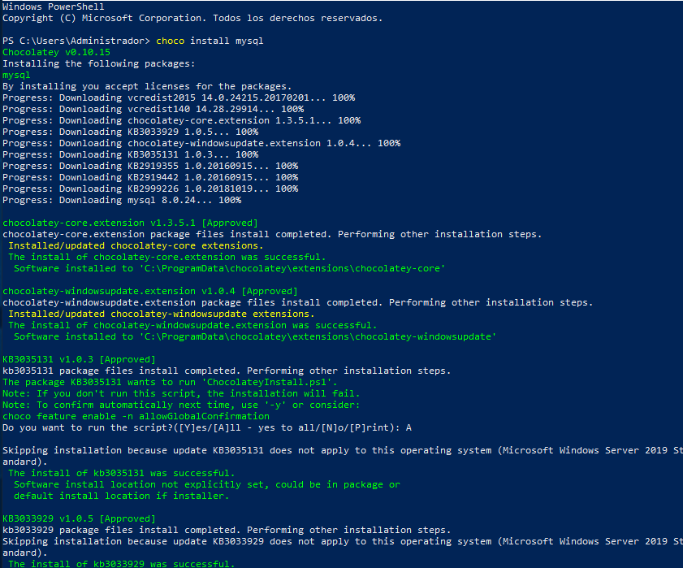
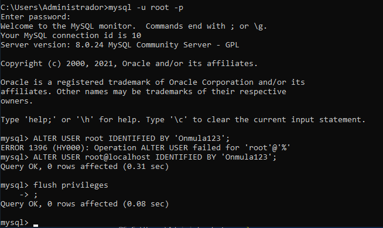
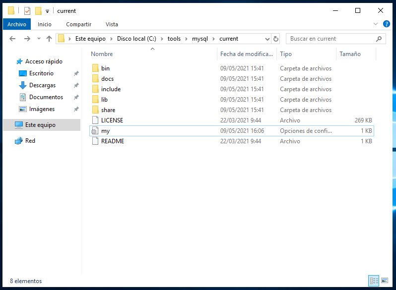
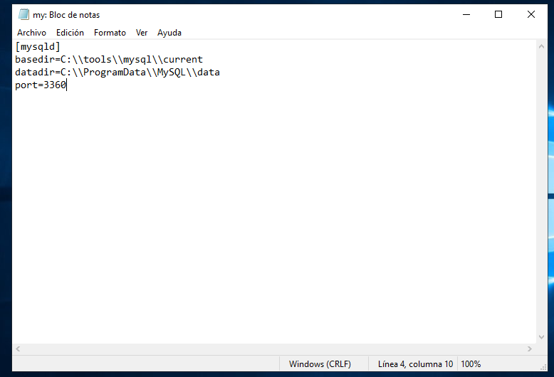

## Instalación de MySQL por Chocolatey

### Introducción

Se va a proceder a instalar el gestor de bases de datos MySQL en un Windows Server 2019 (6/5/2021).

### Preparación de la instalación

1. Para instalar Chocolatey se ejecuta este código desde un terminal de PowerSHELL en modo administrador:  

`Set-ExecutionPolicy Bypass -Scope Process -Force; [System.Net.ServicePointManager]::SecurityProtocol = [System.Net.ServicePointManager]::SecurityProtocol -bor 3072; iex ((New-Object System.Net.WebClient).DownloadString('https://chocolatey.org/install.ps1'))`

### Instalación

2. Una vez finalice, se ejecuta `choco install mysql` en el terminal para instalar MySQL:

3. Como esta instalación crea un usuario root sin contraseña, se le puede añadir una, desde el CMD, con:

` mysql -u root -p`

` ALTER USER root@localhost IDENTIFIED BY 'contraseña';`

` FLUSH PRIVILEGES;`

4. Si se quiere cambiar el puerto, se accede a _C:\tools\mysql\current_ en el buscador de archivos:

5. Se modifica el archivo _"my"_:

El gestor de bases de datos MySQL ya estará correctamente instalado y configurado.
