## Instalación de Microsoft SQL Server 2008

### Introducción

Se va a proceder a instalar el gestor de bases de datos Microsoft SQL Server 2008 en un Windows Server 2019 (6/5/2021).

### Preparación de la instalación

1. Primero se descarga el instalador de esta [página](https://www.microsoft.com/es-es/download/details.aspx?id=1695).

2. Se ejecuta el instalador, una vez se extraigan los archivos necesarios se abrirá el Centro de instalación de SQL Server (Es necesario tener activada la característica .NET Framework 3.5, que incluye .NET 2.0 y 3.0):
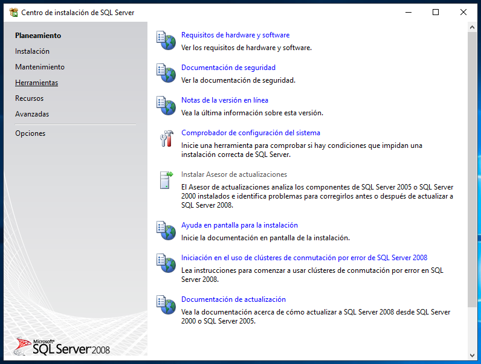

3. Se __selecciona__ la opción _"Comprobador de configuración del sistema"_, que avisaría de problemas que puedan surgir durante la instalación, en este caso no marca ningún error. Se **acepta**:
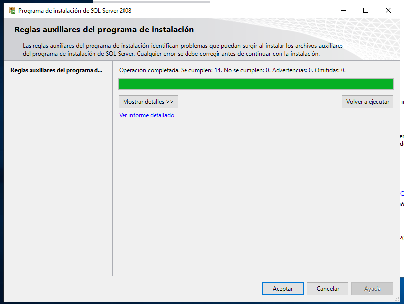

4. Ahora se __selecciona__ _"Instalación"_, en la sección derecha del Centro de instalación de SQL Server:
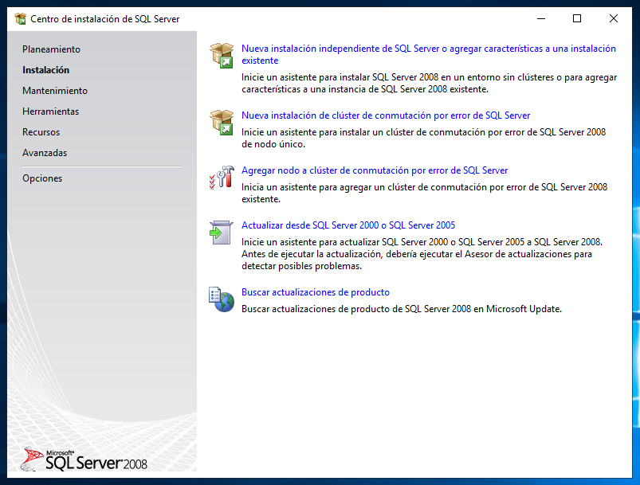

### Instalación

1. Se __selecciona__ la opción de _"Nueva instalación independiente de SQL Server..."_, lo que abre el Programa de instalación de SQL Server 2008. Al principio hace una comprobación, en caso de no aparecer errores se __acepta__:
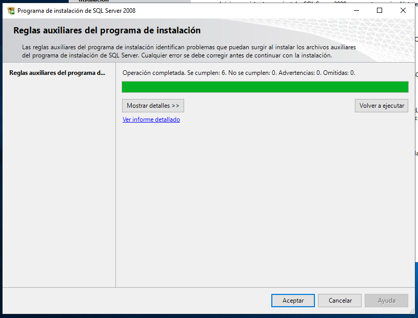

2. Se __selecciona__ la edición gratuita _"Express"_ y se __continúa__:
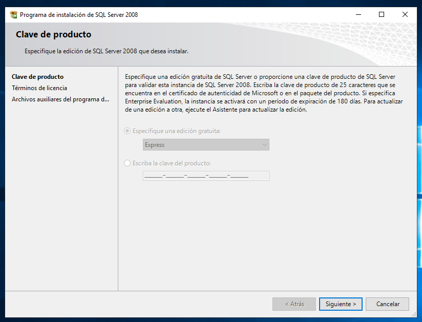

3. Se __aceptan__ los términos de licencia y se __continúa__:
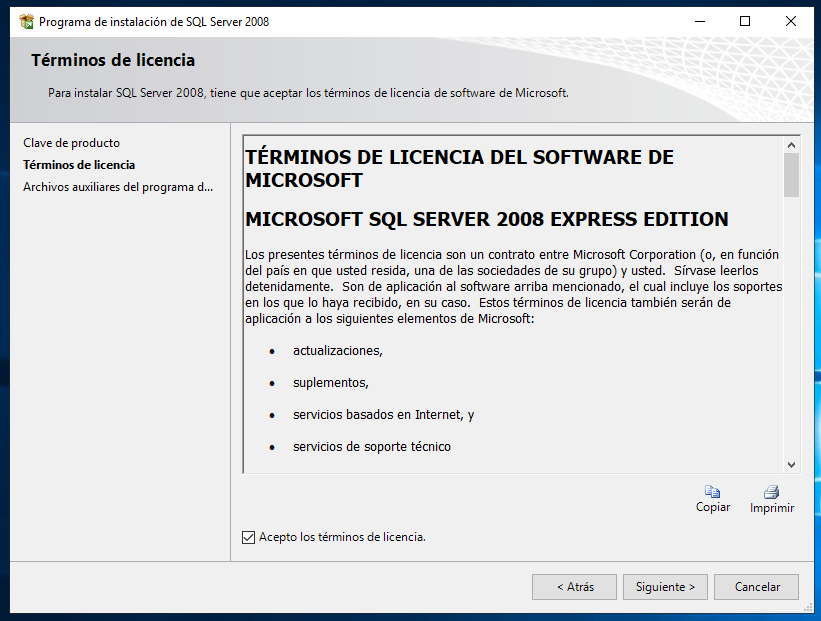

4. Ahora se listan los _"Archivos auciliares del programa..."_, se __pulsa__ en _"Instalación"_:
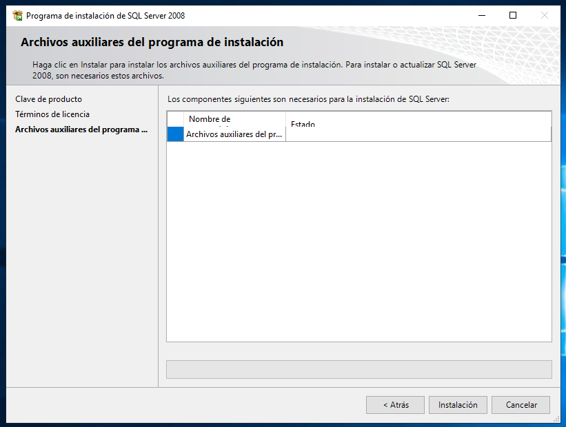

5. Se listan las reglas auxiliares del programa de instalación, si no hay errores se __continúa__ (En este caso aparece una advertencia del _"Firewall de Windows"_ pero como la instalación es para uso local se puede ignorar):
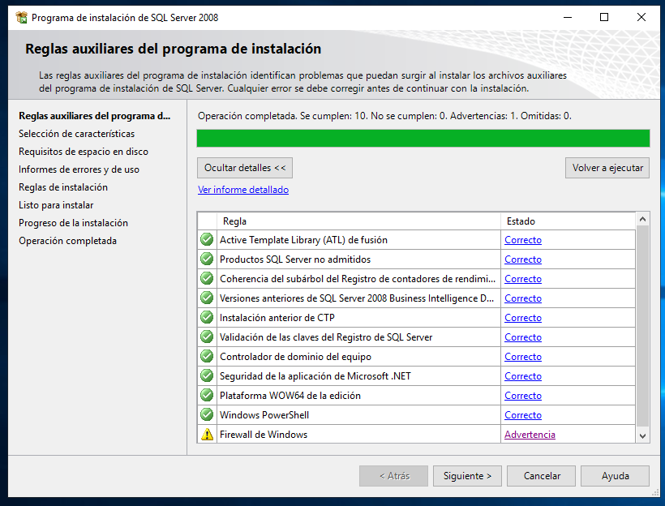

6. Se __seleccionan__ todas las __"Características"__ y se __continúa__:
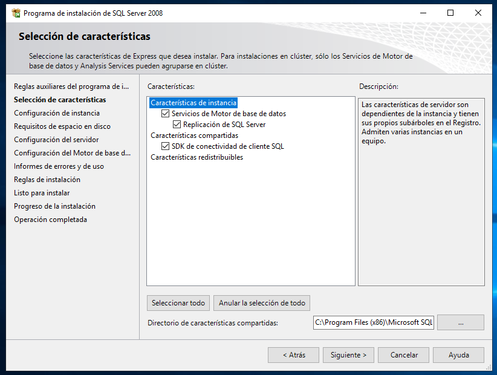

7. Se dejan las opciones por defecto y se __continúa__:
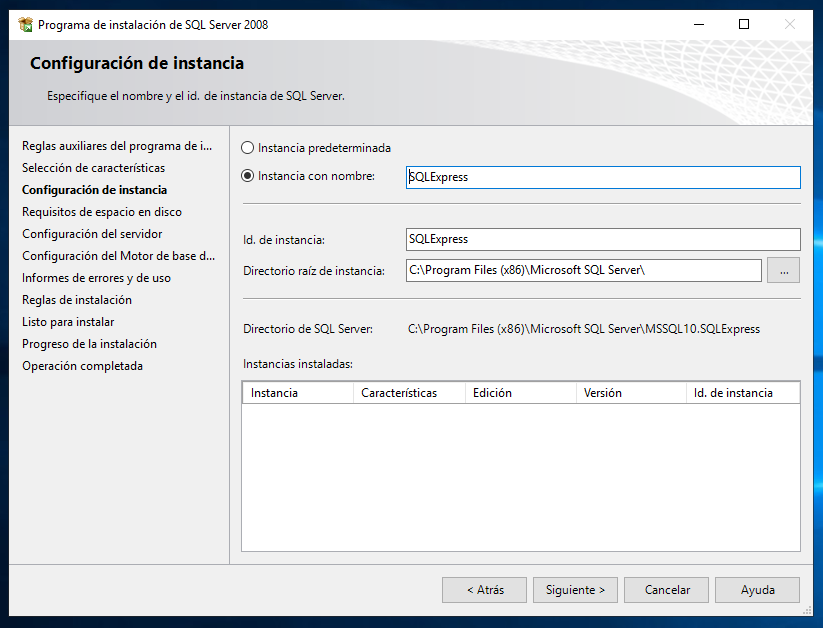

8. Se comprueban los requerimientos de disco, al cumplirse se __continúa__:
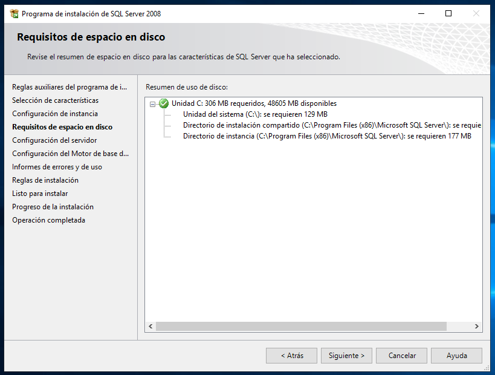

9. Se __añade__ una cuenta para el usuario y una contraseña (en este caso "Administrador" y "Onmula123"), después se __continúa__:
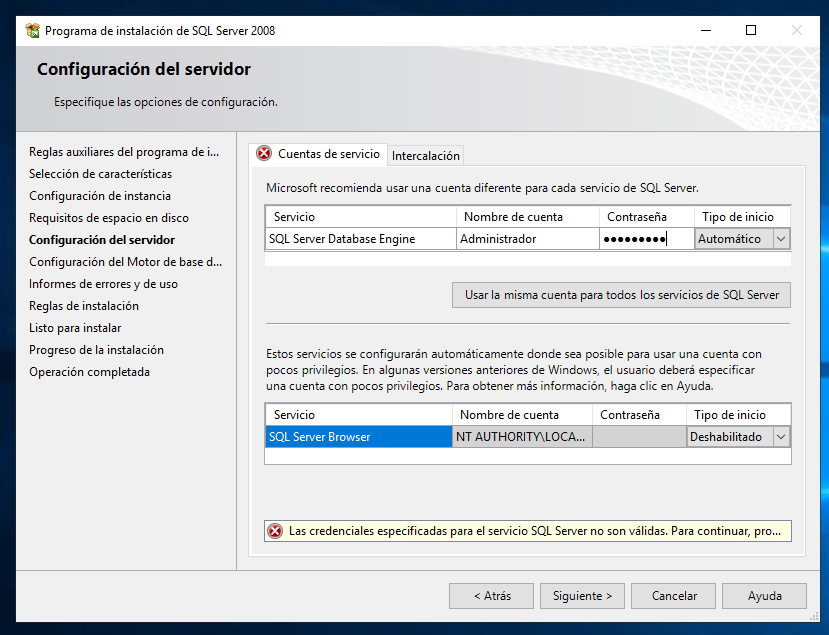

10. En la configuración del Motor de base de datos, se __selecciona__ _"Modo de Autenticación de Windows"_ y se __pulsa__ en _"Agregar usuario actual"_, en caso de estarse instalando desde una cuenta de administración:
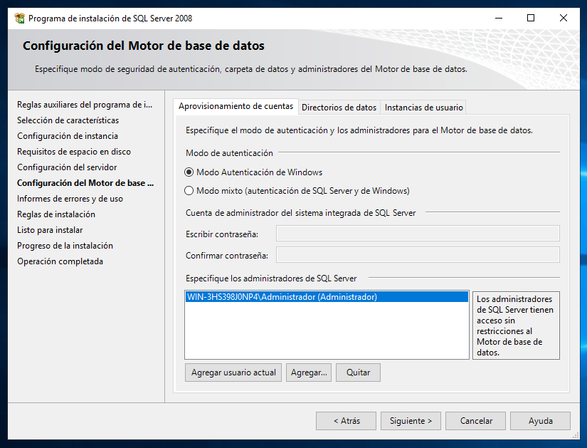

11. Se __continúa__ sin Seleccionar ninguna opción:
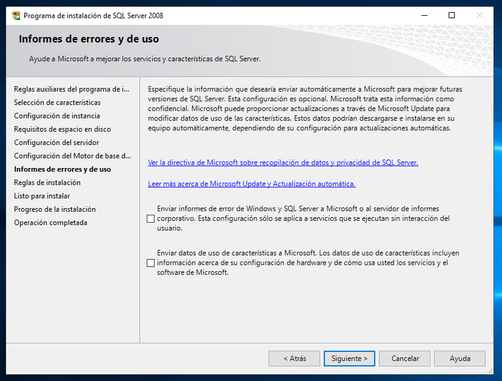

12. Se comprueban las reglas de la instalación, se __continúa__ si no produce ningún error:
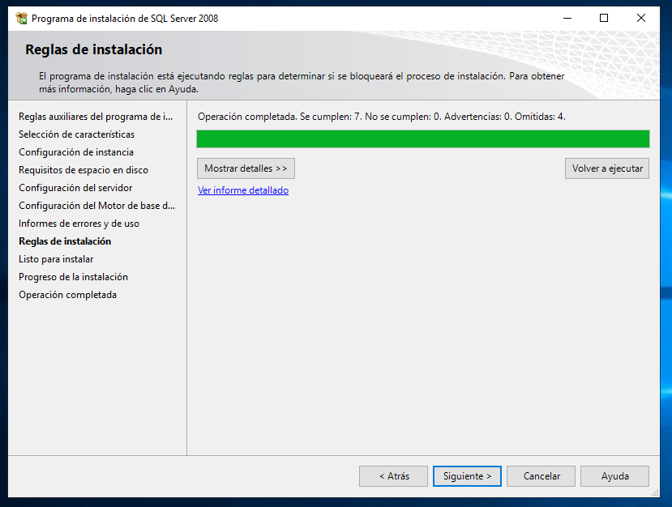

13. Ya está listo para instalar el servidor, se __pulsa__ en _"Instalación"_:
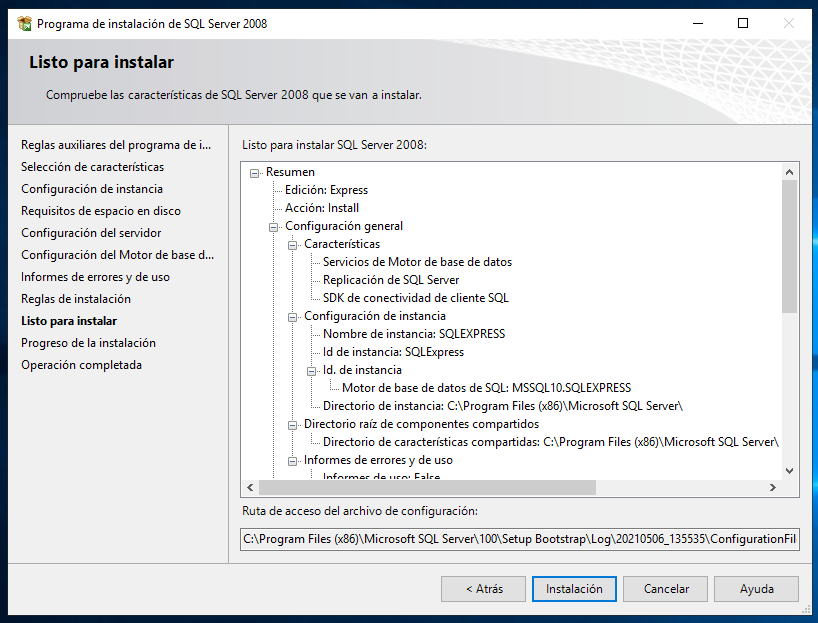

14. El servidor se pondrá a instalarse:
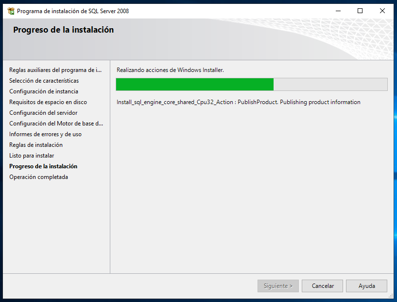

15. Una vez haya finalizado, se __pulsa__ en _"Siguiente"_:
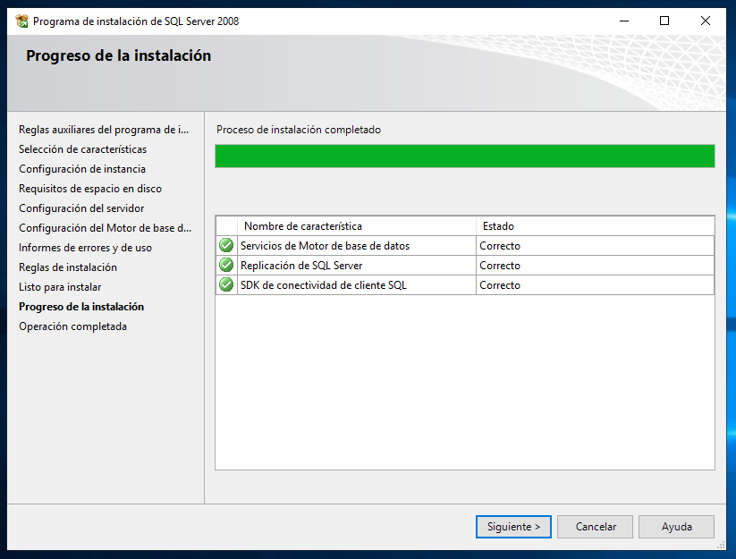

16. Y se procede a __cerrar__ el instalador una vez haya terminado.
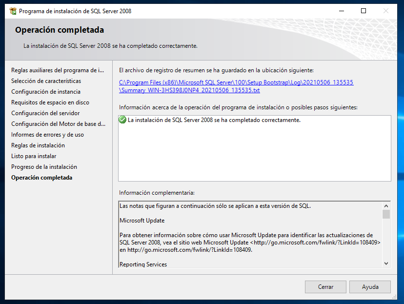

---
[Volver a la instalación del Helpspot](index.md)

