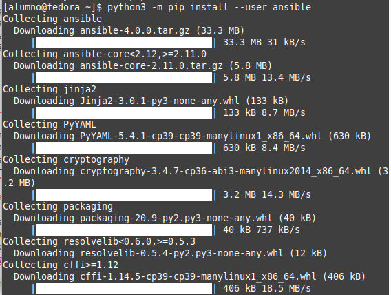
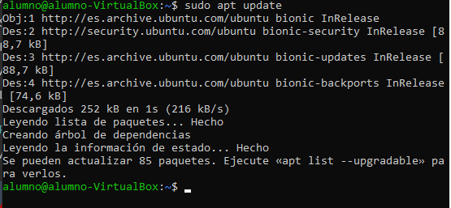
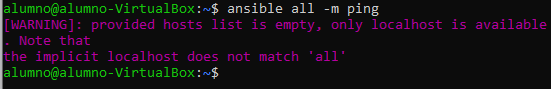

# Instalación y uso básico de Ansible

## Introducción
Se va a documentar la instalación y uso básico de la herramienta de automatización [Ansible](https://www.ansible.com/) para un Ubuntu Server 20.4, en esta guía se van a tratar los siguientes puntos:

1. Instalación de Ansible.
    - Requisitos.
    - Instalación por pip.
    - Instalación en Ubuntu.
    - Instalación por Docker.
2. Configuración de los hosts.
    - Conexión a los hosts.
    - Configuración de un Inventario.
4. Comandos Ad hoc.
5. Comandos y scripts útiles en la automatización.
6. Script de configuración automática.

---
## Instalación de Ansible

### Requisitos

Para el nodo de control se va a requerir Python 2, v2.7, o Python 3, +v3.5, un dato a tener en cuenta es que Windows no tiene soporte como nodo de control.

Los nodos que se están administrando, se va a necesitar la posibilidad de conexión por SSH y por SFTP, aunque en caso de no estar disponible se puede utilizar SCP.

### Instalación por pip

1. Por este método, se va a instalar ansible para un usuario "alumno", en caso de no tener instalado pip, se ejecuta en un terminal:

`$ curl https://bootstrap.pypa.io/get-pip.py -o get-pip.py && python3 get-pip.py --user`

Para instalar Ansible ejecuta el siguiente comando:

`$ python3 -m pip install --user ansible`



En caso de fallar este comando, apareciendo la siguiente línea en su salida: _"Building wheel for ansible (setup.py) (...) error"_, se debe ejecutar:

`$ python3 -m pip install --user wheel`

Si el comando de instalación se ejecuta correctamente, Ansible ya debería estar correctamente instalado en el servidor.

### Instalación en Ubuntu:

1. Desde un terminal se ejecuta el comando:

`$ sudo apt update`



`$ sudo apt install software-properties-common`


`$ sudo add-apt-repository --yes --update ppa:ansible/ansible`


`$ sudo apt install ansible`


Para comprobar que se ha instalado correctamente se ejecuta:

`$ ansible all -m ping`



Esto indica que no hay __hosts__ en el inventario, únicamente localhost, pero confirma que se ha instalado correctamente.

### Instalación por Docker.

En una máquina con [Docker](https://www.docker.com/) instalado se ejecuta, desde un terminal, el comando:

`$ docker run ansible`

Cuando finalice se, se puede comprobar que se está ejecutando con:

`$ docker ps`

Debería aparecer el contenedor de Ansible en funcionamiento.

## Configuración de los hosts.

### Conexión a los hosts.

Para conectar el nodo de control a los hosts que se van a administrar se suele utilizar una conexión por SSH, de forma que los últimos deben tener instalada la clave pública del nodo de control y el servicio OpenSSH-server. Además deben tener el puerto 22 habilitado en su entrada al menos para la dirección del servidor.

Para crear el par de claves pública y privada se ejecuta el comando:

`$ ssh-keygen -f 'Ruta de la clave/ansible-host-key' -t rsa -b 4096`

Y para copiar la clave en los clientes se puede utilizar:

`$ ssh-copy-id -i 'Ruta de la clave/ansible-host-key' usuario@host`

O añadirla manualmente desde el cliente, el cual tiene la clave en el archivo ~/ansible-host-key.pub:

`$ cat 'Ruta de la clave/ansible-host-key.pub' >> '~/.ssh/authorized_keys'`

O ejecutar este script, requiere de tener instalado en el servidor el paquete sshpass, en caso de no tenerlo se instala automáticamente.

```#!/bin/bash
#!/bin/bash
#Nombre del archivo: copiar-claves-servidor.sh

#Comprueba si está instalado sshpass
which sshpass > /dev/null || sudo apt install -y sshpass

#Variables para la ejecución.
direcciones=(
$(nmap -p 22 --open -n $(nmcli dev show $(ip route get 8.8.8.8 | grep "dev *" | cut -d" " -f 5) | grep "^IP4\.ADDRESS.*:" | tr -s " " | cut -d" " -f2) | grep "^Nmap scan" | cut -d" " -f5)
)
ruta=~/.ssh/ansible-host-key.pub
usuario=profesor
#Esto hay que ocultarlo de alguna forma.
contrasena=roseforp

#bucle en el que a cada dirección se le copia una clave
for i in "${direcciones[@]}"
do
    #Copia la clave, redirige la salida a un log.
    sshpass -p $contrasena ssh-copy-id -i $ruta -o StrictHostKeyChecking=no ${usuario}@$i >> copiar-claves.log
done
```

[Enlace de descarga del script.](./copiar-claves-servidor.sh)

### Configuración de un Inventario.

Ahora se va a configurar un inventario de las máquinas clientes, para ello se modifica el archivo **/etc/ansible/hosts** al que se le añade la siguiente configuración:

```
[1ASIR]
PC1   ansible_host=10.1.1.3
PC2   ansible_host=10.1.1.7
PC3   ansible_host=10.1.1.12
PC4   ansible_host=10.1.1.87

[1ASIR:vars]
ansible_user=Profesor
```


Más adelante hay un script que te crea el inventario con los equipos que tengan el puerto 22 abierto.

## Comandos Ad hoc.

Una vez se han inventariado los clientes y se ha copiado la clave pública en ellos, se puede comprobar la conexión a ellos con:

`$ ansible all -m ping`


En caso de que el comando no funcione por no poder autentificar al usuario, se debe acceder al archivo `/etc/ansible/ansible.cfg` y el valor de la siguiente fila:

`private_key_file = /home/profesor/.ssh/ansible-host-key`

[Documentación sobre comandos Ad Hoc.](https://docs.ansible.com/ansible/latest/user_guide/intro_adhoc.html#managing-packages)

La sintaxis básica de un comando Ad hoc es:

`$ ansible {grupo | all} [-m nombre-modulo] -a comando`

Aquí se exponen algunos ejemplos de comandos:

1. Para instalar un paquete con apt:

`$ ansible all -m apt -a "name=paquete" --become -K`

_(Pide autentificación por contraseña)._

2. Para borrar un paquete con apt

`$ ansible all -m apt -a "name=paquete state=absent" --become -K`

_(Pide autentificación por contraseña)._

3. Para ejecutar un script desde de un repositorio:

`$ ansible ASIR1 -m shell -a "wget -qO- https://raw.githubusercontent.com/pelocarioca/pelocarioca.github.io/main/ansible/ss.sh | bash"`

4. Para iniciar un servicio:

`$ ansible ASIR1 -m service -a "name=httpd state=started" --become -K`

_(Pide autentificación por contraseña)._

5. Para reiniciarlo:

`$ ansible ASIR1 -m service -a "name=httpd state=restarted" --become -K`

_(Pide autentificación por contraseña)._

6. O pararlo:

`$ ansible ASIR1 -m service -a "name=httpd state=stopped" --become -K`

_(Pide autentificación por contraseña)._

Para las distintas funciones se deben usar módulos, algunos de ellos son:
- _file_ para modificar archivos.
- _user_ para trabajar con usuarios.
- _service_ para iniciar y detener servicios.
- _copy_ para copiar archivos y ficheros.
- _group_ para trabajar con los grupos.


## Comandos y scripts útiles en la automatización.

Obtención de IP del propio equipo:

`$ nmcli dev show eno1 | grep "^IP4\.ADDRESS.*:" | tr -s " " | cut -d" " -f2`

Obtención de las direcciones física e IPv4 de los equipos de la red:

`$ nmap -sP -n $(nmcli dev show eno1 | grep "^IP4\.ADDRESS.*:" | tr -s " " | cut -d" " -f2) | grep "^Nmap scan" | cut -d" " -f5`

Variable para los hosts con SSH habilitado:

`$ nmap -p 22 --open -n $(nmcli dev show eno1 | grep "^IP4\.ADDRESS.*:" | tr -s " " | cut -d" " -f2) | grep "^Nmap scan" | cut -d" " -f5`

Para obtener la interfaz se puede usar algo parecido a:

`$ ip route get 8.8.8.8 | grep "dev *" | cut -d" " -f 5`

Obtener los equipos con puerto 22 abierto:

`# nmap -sS -p 22 --open 10.1.1.0/24`

Comando para obtener automáticamente los equipos con el puerto 22 abierto:

`nmap -p 22 --open -n $(nmcli dev show $(ip route get 8.8.8.8 | grep "dev *" | cut -d" " -f 5) | grep "^IP4\.ADDRESS.*:" | tr -s " " | cut -d" " -f2) | grep "^Nmap scan" | cut -d" " -f5`

Ahora un script para crear el archivo de inventario:

[Enlace de descarga del script.](./crear-inventario.sh)

Contenido:

```#!/bin/bash2
#!/bin/bash
#Nombre del archivo: crear-inventario.sh
# check if is running as root
[ $(whoami) != root ] && echo "[ERROR] Please, run as root" && exit 1

file=${1:-"/etc/ansible/hosts"}

read -p "Nombre del aula (ASIR1): " aula
aula=${aula:-ASIR1}

function elec {
    read -p "Sobreescribir el archivo? (y/N/c): " sobre
    sobre=${sobre:-N}

    case $sobre in
      Y*|y*)
        echo "[$aula]" > $file
        resul;;
      N*|n*)
             echo "[$aula]" >> $file
        resul;;
      C*|c*)
        exit;;
      *)
        echo "Vuelve a intentarlo"
        elec;;
    esac
}

function resul {
    echo "Buscando IPs con el puerto 22 abierto"
    dev=$(ip route get 8.8.8.8 | grep "dev *" | cut -d" " -f 5)
    nmap -p 22 --open -n $(nmcli dev show $dev | grep "^IP4\.ADDRESS.*:" | tr -s " " | cut -d" " -f2) | grep "^Nmap scan" | cut -d" " -f5 >> $file

    echo "" >> $file
    echo "Generando variables"
    echo "[$aula:vars]" >> $file
    echo "ansible_user=$usuario" >> $file

    echo "Fichero generado $file:"
    cat $file
    exit 0
}
elec
```

## Script de configuración automática.

El script final que lo hace todo:

[Enlace de descarga del script.](./superscript.sh)

Contenido:
```
#!/bin/bash
#Nombre del archivo: superscript.sh

# check if is running as root
[ $(whoami) != root ] && echo "[ERROR] Please, run as root" && exit 1

#variables
read -p "Nombre del aula (ASIR1): " aula
aula=${aula:-ASIR1}

read -p "Usuario (profesor): " usuario
usuario=${usuario:-profesor}

read -sp "Contraseña (********): " contra
echo ""
contra=${contra:-roseforp}

read -p "Ruta/Nombre de la clave (~/.ssh/ansible-host-key): " rutakey
rutakey=${rutakey:-~/.ssh/ansible-host-key}
echo "La clave privada se llamará: $rutakey"
rutapub="$rutakey.pub"
echo "La clave pública se llamará: $rutapub"

read -p "Ruta del archivo de salida (/etc/ansible/hosts): " file
file=${1:-"/etc/ansible/hosts"}

function elec {
    read -p "Sobreescribir el archivo? (y/N/c): " sobre
    sobre=${sobre:-N}

    case $sobre in
      Y*|y*)
        echo "[$aula]" > $file
        resul;;
      N*|n*)
             echo "[$aula]" >> $file
        resul;;
      C*|c*)
        exit;;
      *)
        echo "Vuelve a intentarlo"
        elec;;
    esac
}
function resul {
#Crea el par de claves
/bin/su --command "ssh-keygen -f ""$rutakey"" -t rsa -b 4096" $usuario

#Comprueba si está instalado sshpass
which sshpass > /dev/null || apt install -y sshpass


#direcciones=("10.1.1.7" "10.1.1.12" "10.1.1.87")
#Recoge las direcciones y las almacena en un array llamado direcciones
direcciones=(
$(nmap -p 22 --open -n $(nmcli dev show $(ip route get 8.8.8.8 | grep "dev *" | cut -d" " -f 5) | grep "^IP4\.ADDRESS.*:" | tr -s " " | cut -d" " -f2) | grep "^Nmap scan" | cut -d" " -f5)
)

#bucle en el que a cada dirección se le copia una clave
for i in "${direcciones[@]}"
do
    #Copia la clave, redirige la salida a un log.
    sshpass -p $contra ssh-copy-id -i $rutapub -o StrictHostKeyChecking=no ${usuario}@$i >> copiar-claves.log
done
contra="o"


    echo "Buscando IPs con el puerto 22 abierto"
    #dev=$(ip route get 8.8.8.8 | grep "dev *" | cut -d" " -f 5)
    #nmap -p 22 --open -n $(nmcli dev show $dev | grep "^IP4\.ADDRESS.*:" | tr -s " " | cut -d" " -f2) | grep "^Nmap scan" | cut -d" " -f5 >> $file
    for i in "${direcciones[@]}"
    do
      echo $i  >> $file
    done


    echo "" >> $file
    echo "Generando variables"
    echo "[$aula:vars]" >> $file
    echo "ansible_user=$usuario" >> $file

    echo "Fichero generado $file:"
    cat $file
    echo "Verifica el ping introducido con: ansible $aula -m ping"
    exit 0
}
elec
```
