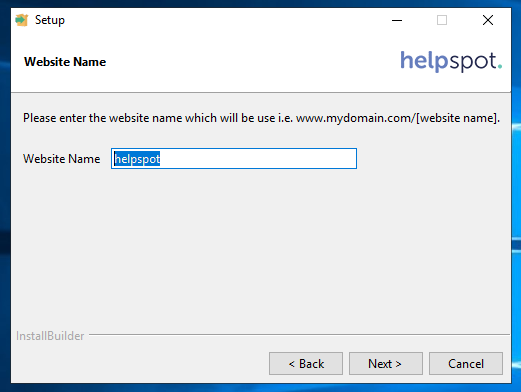

# Práctica: uso de HelpSpot

## Introducción
Se va a documentar la instalación y uso básico de la aplicación de soporte técnico, helpdesk y gestión de tickets HelpSpot, en esta guía se van a tratar los siguientes puntos:

1. Descarga de HelpSpot.
1. Instalación para Windows Server 2019.
  - Utilizando [Microsoft SQL Server 2008](SQLServer.md). (Opc. A)
  - Utilizando [MySQL](MySQL.md). (Opc. B)
2. Uso básico del producto.
  - Tickets.
  - Librería de autoservicio (Self Service Knowledge Base).
  - Análisis e informes.
  - Encuestas.
  - Creación de staff.

---
## Descarga de HelpSopt

1. En primer lugar se __accede__ al sitio web https://www.helpspot.com/free-help-desk-software, donde se __pulsará__ en el botón de _"Try it free"_.

2. Esto llevará a una sección de registro, donde habrá que __crear__ una cuenta, en este caso se __selecciona__ la opción de _"DOWNLOAD TRIAL"_.

3. Al hacer esto se abrirá la página donde se puede descargar la licencia y el ejecutable, se __descargan__ y se guardan en el escritorio:

---
## Instalación del producto

1. Una vez se han descargado correctamente, se __ejecuta__ el instalador.

2. Se __aceptan__ los términos de la licencia y se continúa.

3. Se __selecciona__ el servidor _"Microsoft IIS Server"_ y se continúa.

4. También se __selecciona__ el motor de bases de datos, se puede utilizar [Microsoft SQL Server](SQLServer.md) (Opción A) ó [MySQL Server](MySQL.md) (Opción B).

5. En caso de escoger Microsoft SQL Server, pedirá una confirmación, se __pulsa__ _"Sí"_:

6. Se __selecciona__ la ubicación de la instalación, en este caso se instala en la ubicación por defecto:

7. Se __introducen__ los datos de la cuenta de administración, en este caso son
- _Administrator Name: "Alumno"_
- _Administrator Email: "cassiopea_acebes_prado@iesdomingoperezminik.es"_
- _Company Name: "IES Domingo Pérez Minik"_:

8. Se __introduce__ una contraseña para la cuenta de administración, en este caso _"Onmula123"_:

9. Se __selecciona__ la zona horaria, en este caso _"Atlantic/Canary"_:

10. Se __introducen__ el _"Customer ID"_ y el _"Licence File"_:

11. Ahora se __introduce__ una dirección de correo para las respuestas a las notificaciones, en este caso se usa _"cassiopea_acebes_prado@iesdomingoperezminik.es"_:

12. Se __introduce__ un nombre para el sitio web de IIS:

13. En el nombre de dominio, se deja la opción por defecto:

14. Y se __selecciona__ el nombre de la página web que se va a usar, se deja por defecto:

---
## Opción A
15. Se __selecciona__ la dirección y el puerto del servidor de bases de datos, se dejan las opciones por defecto:

16. Se __selecciona__ la opción de _"Create a new database"_:

17. Se __introducen__ los datos de la cuenta de la base de datos (helpspot es un usuario del MS SQLServer, que ha sido configurada para aceptar inicios de sesión de cuentas de MS SQLServer):
- _Username: "helpspot"_
- _Root Password: "Onmula123"_

---
## Opción B

15. Se __selecciona__ la opción de _"I wish to use the bundled MySQL database..."_:

16. Se __selecciona__ el puerto, en este caso como el predeterminado produce un error se selecciona el 3360 (Hay que modificar el puerto también en MySQL):

17. Se __introduce__ la contraseña del usuario root de MySQL:

18. Ahora se __crea__ un usuario con los siguientes datos:
- _HelpSpot DB Name: "helpspot_db"_
- _HelpSpot DB User Name: "helpspot_user"_
- _HelpSpot DB User Password: "Onmula123"_

---
19. Una vez esté todo configurado, el servicio podrá instalarse:

20. El instalador comenzará a desempaquetar los archivos y a instalar los complementos necesarios:

21. Una vez finalice, ya se habrá instalado correctamente HelpSpot en el servidor, la configuración continuará en el navegador desde la dirección _"127.0.0.1/helpspot/login"_:

22. Se accede al sitio Web _"127.0.0.1/helpspot/login"_, en este se __inicia sesión__ con los datos introducidos en la instalación:
- _"you@company.com:  cassiopea_acebes_prado@iesdomingoperezminik.es"_
- _"password: Onmula123"_

23. Se cargará la página de inicio de HelpSpot:

---
# Uso básico del producto.

## Tickets.

Los tickets disponibles para su asignación están en "Workspace>Inbox", de esta forma los técnicos de helpdesk pueden asignarse tickets, reasignar a otro técnico, marcarlos como SPAM, añadir un estatus o responder en grupo junto a otros tickets:

En caso de querer tomar un ticket para su resolución, se __pulsa__ en _"Take it"_ junto al nombre del cliente. Al hacer esto se entrará en la pantalla de actualización de tickets (los tickets tomados y no resueltos aparecerán en _"My Queue"_):

En este apartado se puede responder al ticket con texto, imágenes y archivos. Se pueden buscar respuestas predefinidas para problemas típicos o entradas de la Self Service Knowledge Base. También se puede marcar la respuesta como pública o privada, cerrar el ticket y marcarlo como urgente. Para actualizar el ticket (y también para cerrarlo), debe pertenecer a una categoría. Esto se hace en la sección derecha de la página:

Se puede configurar la respuesta, de forma que se puede modificar el asunto del email, la dirección desde la que se envía, notificar a uno o varios administradores. Además se puede añadir una Carbon Copy y una Blind Carbon Copy:

Se puede marcar el ticket como urgente en la sección derecha de la página, __pulsando__ el botón de _"Mark Urgent"_:

Para cerrar un ticket, una vez ha sido resuelto, se debe de __cambiar__ su estatus a _"Problem Solved"_ y se debe __pulsar__ en _"Update+close"_:

El ticket se enviará a la basura una vez se ha resuelto, aún así se puede devolver al _inbox_ en caso de ser necesario.

Otra función de los tickets es revisar el registro de cambios del mismo, haciendo ___click___ sobre _"Initial Request"_ desde la sección de _"My Queue"_ o debajo de las opciones de envío dentro del ticket:

>_"Initial Request"_.

>Debajo de las opciones de envío.

Por último, se pueden revisar los datos del cliente, el historial del cliente y una opción de _Live Lookup_, para asistir a los clientes en tiempo real, desde las pestañas encima del apartado de respuestas:

>Datos del cliente

>Historial del cliente

>_Live Lookup_

---
## Librería de autoservicio (Self Service Knowledge Base).

En la sección _"Knowledge"_ se pueden crear, modificar y eliminar libros de la KB:

Para crear un libro, se ha de escoger un nombre, su tipo (privado o público), sus editores y una descripción, después se __pulsa__ en _"Add Knowledge Book"_:

Una vez se crea el libro, __pulsa__ sobre él en la _lista de la sección derecha_ para poder modificarlo. Desde ahí se puede visualizar el contenido del mismo en la sección central, editar la configuración del libro en _"Edit Book"_ o añadir capítulos nuevos en _"Edit Chapter"_:

Para añadir un capítulo se pulsa en _"Add Chapter"_, una vez dentro se puede añadir su nombre, controlar su visibilidad, ordenarlo o convertirlo en un apéndice del mismo. Se va a crear un capítulo sobre la instalación de HelpSpot:

Una vez creado la estructura del libro tendrá este aspecto, se puede modificar el capítulo o añadir páginas. Ahora se va a añadir una página __pulsando__ sobre _"Add Page"_:

Primero se __introduce__ el título de la página y se __selecciona__ el orden dentro del capítulo. Una vez se tengan se __pulsa__ en _"Add Page"_:

Ahora se accede a la edición de la página. Se pueden modificar su título, su visibilidad o el contenido de la misma en formato HTML:

Más abajo se pueden añadir _tags_ a la página y modificar detalles como su órden en el capítulo, el capítulo en el que se encuentra, si está destacada, añadir un archivo descargable, seleccionar páginas relacionadas, guardarla o borrarla. Para este ejemplo se va a guardar la página recién creada:

El libro ahora tendrá este aspecto:

De esta forma se pueden editar los libros de la KB.

---
## Análisis e informes.

A este apartado se accede desde la pestaña _"Reports"_:

Desde aquí se pueden comprobar las estadísticas sobre los tickets por hora recibidos, número de respuestas hasta el cierre, etc. También desde la sección izquierda se puede acceder a diferentes informes.

Estos informes se pueden guardar como CSV o enviarse por email, entre otras funciones.

---
## Respuestas predefinidas.

Otra característica de este servicio es la posiblidad de generar respuestas predeterminadas a preguntas comunes a fin de agilizar la resolución de tickets.

Se va a generar una de estas respuestas, para ello se __introduce__ el título, un texto con la respuesta en texto (formateada como Markdown y a la que se le pueden incluir variables como el ID o el _access key_ del cliente) y una carpeta que contendrá las respuestas:

Luego se __selecciona__ el propietario de la respuesta, archivos que pueden ir incluidos en esta y algunas acciones que se producen en el ticket cuando se adjunta esta respuesta, en este caso cierra el ticket, cambia su categoría a "otro" y se le asigna a "none Alumno":

Por último, se puede configurar esta respuesta como un ticket que se abre en cada cierto tiempo. De forma que se pueden crear recordatorios a los técnicos.

Una vez creada, la respuesta aparecerá así:

---
## Creación de staff.

Para añadir usuarios a la plataforma, se __accede__ a _"Admin > Staff"_:

Desde aquí se puede configurar completamente una nueva cuenta de _staff_, desde el tema que utiliza hasta notificaciones por SMS, las categorías que tiene asignadas, etc.

En general, la pestaña de _"Admin"_ contiene la configuración del servicio como exportación de los datos de los clientes, crear reglas, _triggers_, añadir campos a los formularios de tickets.

También se puede integrar HelpStop con servicios de encustas o modificar el portal de los tickets (127.0.0.1/helpspot).
